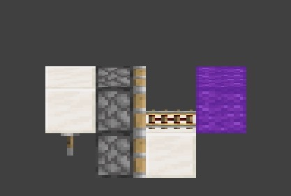
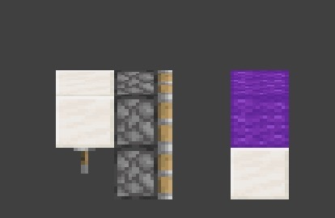
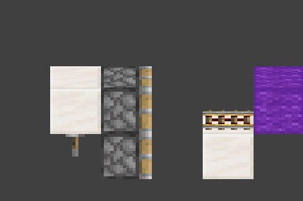
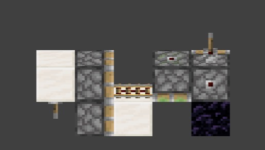
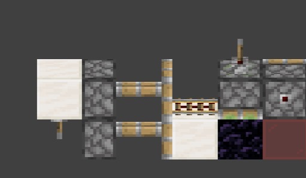
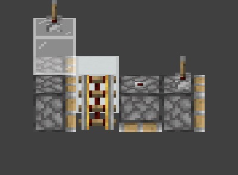

# 仅客户端的方块操纵

假方块，大家多少都有耳闻。

你可能已经见过一些经典用法：比如利用假方块积攒玩家的下坠动量，触发“非法飞行”的反作弊检测；又或者是空气假方块，可以把玩家卡在空气里。

但假方块的能耐远不止如此。

实际上，如果利用一些特殊结构，我们甚至可以**利用假方块操纵客户端里的方块**。
这允许我们在玩家的客户端中移动甚至替换方块，而服务器世界本身并没有发生这些变化。

为了理解这些，让我们需要先从假方块产生的原因开始。

---

Minecraft的世界分为 **服务端** 和 **客户端**，两个世界。前者存在于服务器中，专注于各种游戏逻辑，而后者存在于玩家的客户端，主要为玩家交互，画面渲染提供数据。为了维护两个世界的正确关系，**同步**是相当重要的工作。服务器上的方块被破坏、被放置、实体移动等，服务器会向客户端发送更新包，让客户端的世界保持一致。
但在这个过程中，并不是所有内容都需要严格地频繁同步：这会制造巨大的压力。实际上，基于一定的信息，客户端世界可以模拟服务器发生的事件。

例如…活塞。而这，就是一切开始的地方。

当活塞执行动作时，服务器并不会把生成的“MovingPiston方块”同步给客户端。相反，服务器只会发送一个 **Block Event（方块事件）**，告诉客户端“这个活塞现在应该面向哪里，应该推出还是收回”。

接下来发生的事情，就完全交给客户端自己处理了。客户端会根据自己当前的世界状态，去计算哪些方块应该被推动，并在本地模拟出整个推动动画。

这种设计的好处很明显。服务器不需要同步一整串移动方块的数据，只需要发出一个事件，客户端就能自己算出结果，既节省资源，也能动画等更加流畅。

当然，这个机制成立有一个前提：客户端和服务器**必须对世界状态有相同的理解**。

而一旦这个前提被打破，事情就开始变得奇怪。

如果客户端和服务器对某个位置的方块状态出现了分歧，那么当活塞事件到来时，客户端就会按照自己的世界状态去模拟推动过程。于是客户端可能会推动一个服务器已不再存在的方块，又或者移动一个服务器根本无法移动的结构。

结果就是，客户端的世界的方块与服务器发生了错位，这是制造**幽灵方块**最简单的方式之一。

### 但真正的问题是：如何制造这种不同步？

Minecraft 的服务器的 Tick 逻辑里，有两个阶段非常关键。

一个是负责同步方块变化的阶段。当服务器上的方块发生改变时，这些变化会在这个阶段被打包成网络数据发送给客户端，从而让客户端更新世界状态。

另一个阶段则是处理方块事件，也就是我们刚才提到的 Block Event，比如活塞推出和收回。

而关键之处在于，这两个阶段的执行顺序。

引用FallenBreath的简化阶段树

这是1.12中各个主要阶段的顺序:
```java

游戏循环
├── 玩家动作
├── 对于每一个维度
│   ├── 自然刷怪
│   ├── 区块卸载
│   ├── 更新世界时间
│   ├── 计划刻
│   ├── 区块刻
│   ├── 方块变化同步 // [!code focus]
│   ├── 方块事件    // [!code focus]
│   ├── 实体
│   └── 方块实体
├── 玩家实体
└── 自动保存

```
在往上，如1.16.5:

```java

游戏循环
├── 对于每一个维度
│   ├── 更新世界时间
│   ├── 对于每一个区块
│   │   ├── 方块变化同步 // [!code focus]
│   │   ├── 自然刷怪
│   │   └── 区块刻
│   ├── 区块卸载
│   ├── 计划刻
│   ├── 方块事件        // [!code focus]
│   ├── 实体
│   └── 方块实体
├── 玩家实体
├── 自动保存
└── 玩家动作

```
乃至最新版本：

```java

游戏循环
├── 对于每一个维度
│   ├── 更新世界时间
│   ├── 计划刻
│   ├── 对于每一个区块
│   │   ├── 自然刷怪
│   │   └── 区块刻
│   ├── 方块变化同步 // [!code focus]
│   ├── 区块卸载    // [!code focus]
│   ├── 方块事件
│   ├── 实体
│   └── 方块实体
├── 玩家实体
├── 自动保存
└── 玩家动作

```
可以发现，**方块变化同步阶段，总是发生在方块事件阶段之前。**

这意味着，如果某个方块变化是在**方块事件阶段前，或执行中才发生的**，那么客户端在执行方块事件的时候，它将错过本 Tick 中的方块同步阶段，除非特殊声明，客户端不会知这个变化。它只能在下一个 Tick 才收到对应的同步数据。
于是，当客户端开始执行一个方块事件，比如模拟活塞推动时，它使用的是一个已经有些“过时”的世界模型。而这正是制造假方块的关键窗口。

只要我们在服务器的方块事件阶段制造方块变更，它将无法及时同步至客户端。而客户端会按照旧的世界状态进行模拟，从而产生错位。

比如，下面的例子：




拉动拉杆激活一次活塞，在这个结构下，由于更新顺序，对着石英块的活塞会比对着铁轨的活塞先推出。

在服务器端看起来是这样的：

> - 对着石英块的活塞率先推出
> - 这导致铁轨失去了合法的附着物，于是掉落了。
> - 当对着铁轨的活塞进行推出时，由于铁轨不在再存在，所以它只会伸出，但无法推动铁轨后的紫色羊毛
> 
> 

但注意，上述过程中，铁轨的破坏**发生在方块事件阶段**，这意味着它无法及时同步到客户端。

所以，在客户端视角看起来是这样的：

> - 对着石英块的活塞率先推出
> - 这导致铁轨失去了合法的附着物，但客户端没有相关逻辑，而服务器中铁轨掉落这个变更也**错过了方块同步阶段**，铁轨不会掉落。
> - 当对着铁轨的活塞进行推出时，由于铁轨仍然存在，它会推动铁轨和紫色羊毛到新的位置
> 
> 

而通过如上方法，我们就获得了制造任何**可推动方块**的假方块的能力了。

### 那如果制造**一个活塞**的假方块呢？

现在，你大概能猜到我们将要说什么了，没错。如果客户端可以存在活塞假方块，那么是否能让这个活塞继续推出，从而自由地操纵客户端的方块呢？

让我们想想。活塞的行为是方块事件驱动的。如果客户端的“假活塞”可以接受到一个来自服务器方块事件，那它理应能执行它指示的行为。于是我们就得到了一个非常直接的问题：**如何让服务器在“假活塞”的位置发送一个方块事件？**

如果稍微回想一下刚才构造假方块时发生的事情，就会发现答案其实已经摆在眼前。

在之前的例子里，我们制造了一个羊毛的假方块。与此同时，我们让客户端世界中的铁轨与服务器端的羊毛错位了：**客户端看到的是一段铁轨，但服务器对应的位置其实是一块羊毛**

这种错位本身其实没有什么特别的，但一旦涉及到方块事件，情况就变得完全不同了。客户端接收方块事件的时候，并不在意客户端看到的是什么方块。这意味着，只要客户端的方块和服务器的方块不一致，我们就可以让客户端在完全不同的方块上执行服务器发出的方块事件。

我们可以利用刚才的方法，让客户端在某个位置拥有一台假活塞；而在服务器看来，这个位置其实是另一个会产生方块事件的方块，比如一台朝向不同的活塞。

> 
>
> 拉下石英块下的拉杆后，**朝下的粘性活塞**与**朝后的普通活塞**发生错位，此时，**朝后的普通活塞**发出的方块事件在客户端由**朝下的粘性活塞**执行。当拉动右侧的拉杆，使**朝后的普通活赛**0t并放出**收回**方块事件时，**朝下的粘性活塞**会因此在客户端吞掉黑耀石...
>
> 

就是如此。到这里为止，你其实已经掌握了这个机制的全部基础：

> ### 客户端可以拥有服务器不存在的方块，活塞的行为由方块事件驱动，而只要客户端和服务器的方块错位，服务器发送的事件就可能作用假活塞方块上。

接下来，我们就可以开始做一些真正有趣的事情了

## 移动假方块

## 假活塞操作



### 操纵假活塞推出

首先来看最直观的应用：让假活塞推出方块。

搭建右侧的装置。

拉下装置左侧拉杆使客户端与服务器的活塞产生错位。此时客户端在绿色玻璃上的是朝下的活塞，而服务器在同一位置实际上是朝上的活塞。

> 拉下右侧拉杆，或者直接给右侧拉杆所对着的方块充能。服务器朝上的活塞推出，而客户端则会把这个事件解释为假活塞朝下的推出动作。
>
>- 若绿色玻璃处存在方块，其会被推出。（粘液块等同样能正常发挥功能）
>
>- 收回完成之后，客户端里的假活塞会被纠正。（一个双头活塞作为附产物产生：一端是服务器推出后纠正假活塞得到的正常活塞和活塞头，而另一端则是由假活塞残留下的假活塞头。）
>
这个结构在所有方向上成立。

### 操纵假活塞收回

我们能够驱动假活塞推出，也可以反过来利用它的收回行为。

搭建上图左侧的装置。装置左侧依然负责生成假活塞，而右侧负责触发服务器的方块事件。

>当左侧拉杆被拉下之后，拉动右侧拉杆（右侧拉杆附着在活塞侧面，本身就是 0T 发生器）或使用 0T 脉冲给右侧拉杆对着的方块充能。此时服务器会触发活塞收回，而客户端则会让假活塞执行收回动作。
>
>- 若红色玻璃位置存在方块，其会被假活塞当作活塞杆吞噬，制造假空气方块。
>
>- 若红色玻璃下存在方块，其会被假活赛拉回至红色玻璃位置。（粘液块等同样能正常发挥功能）
>
>- 收回完成之后，客户端里的假活塞会被纠正。
>
这个结构同样在所有方向上成立。

## 方块事件曲解


