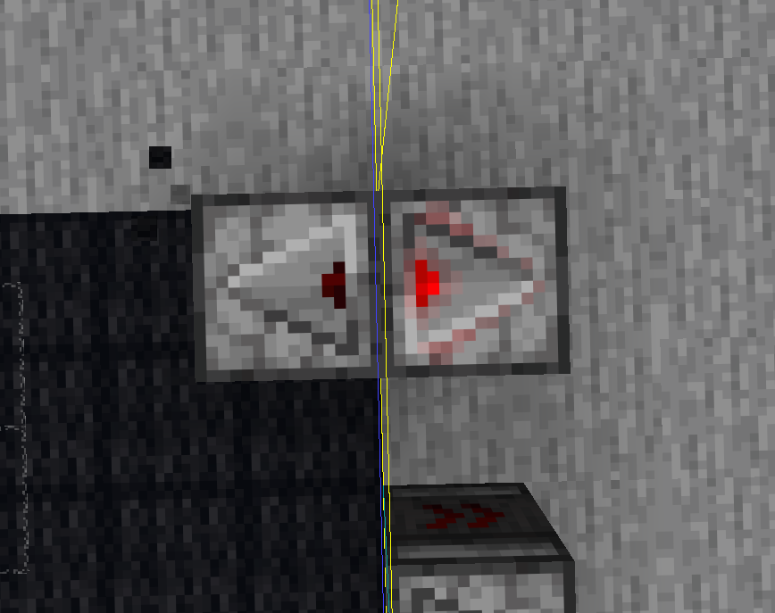

# MC-310372 (0gt 延迟调度引发的区块刻乱序问题)

一篇[漏洞报告](https://bugs.mojang.com/browse/MC/issues/MC-310372)引起了我们的注意。

下为漏洞报告描述的翻译：
> 下面是按 **Minecraft 技术讨论 / Bug Tracker（如 Mojira）** 的术语习惯翻译的版本，尽量保留了原文的技术含义。
>
> 在 **26.2** 中，为了修复 **MC-305475**，绊线（Tripwire）在失去红石信号后会为自己安排一个 **0gt 延迟**的计划刻（scheduled tick），并在该计划刻中检查自身是否仍有计划刻，以防止它在断电后立即重新上电。
>
> 问题在于，**游戏刻（game tick）已经完成计划刻收集之后再添加的 0gt 延迟计划刻，并没有被计划刻调度逻辑正确处理。**
>
> 这会导致，在**计划刻阶段（scheduled tick phase）**中，一个区块（chunk）最先执行的计划刻变成这个 **0gt 延迟计划刻**，因为根据 **DRAIN_ORDER**，它的 **trigger tick** 比该区块内其他所有计划刻都更早。
>
> 然而，在游戏收集即将执行的计划刻时，选择区块计划刻容器（chunk tick container）所依据的是 **INTRA_TICK_DRAIN_ORDER**。该排序**完全忽略了 trigger tick**，而是直接按照 **TickPriority** 和 **subTickOrder** 排序。
>
> 由于这个 0gt 延迟计划刻使用的是 **TickPriority.NORMAL**，同时又拥有**很高的 subTickOrder**（因为它是在计划刻执行期间以 0 延迟安排的），这会导致**下一游戏刻中，该区块的计划刻会比其他区块更晚处理**，即使按照正常顺序它们本不应该如此（见下图示例）。
>
> **注意：**任何依赖**跨区块方块计划刻执行顺序（cross-chunk block tick ordering）**，且包含已激活绊线的装置，都可能受到该问题影响。
> ...

# 分析：

初看报告里的描述，仍然云里雾里，难以看懂问题所在。

报告后半段的（已截去），针对 MC-305475（另一个漏洞）的修复建议也无疑让理解进一步变难。

所以本篇文章希望能够帮助读者理解**该计划刻调度的漏洞**。


## 1. `LevelTicks` 的 排序逻辑分析

在计划刻阶段，`LevelTicks.tick()` 会调用 `collectTicks()` 收集本刻需要执行的计划刻。

收集流程与排序逻辑如下：

### 阶段一：`sortContainersToTick`（筛选与跨区块排序）

#### 工作内容
遍历 `nextTickForContainer` 记录的所有区块，将下次触发时间 `<=` **当前时间** 的 **区块容器**（`LevelChunkTicks`）挑选出来，加入到名为 `containersToTick` 的优先队列中。

#### **排序规则**：
`containersToTick` 的比较器为 `CONTAINER_DRAIN_ORDER`，它直接对比两个区块队首的 tick，使用的是 **`ScheduledTick.INTRA_TICK_DRAIN_ORDER`**。

```java
private static final Comparator<LevelChunkTicks<?>> CONTAINER_DRAIN_ORDER = (levelChunkTicks, levelChunkTicks2) -> ScheduledTick.INTRA_TICK_DRAIN_ORDER
		.compare(levelChunkTicks.peek(), levelChunkTicks2.peek());
```

**注意！** `INTRA_TICK_DRAIN_ORDER` **完全忽略 触发时间（`triggerTick`）**，仅依次比较 计划刻优先级（`priority`）和 子顺序（`subTickOrder`）。
```java
public static final Comparator<ScheduledTick<?>> INTRA_TICK_DRAIN_ORDER = (scheduledTick, scheduledTick2) -> {
	int i = scheduledTick.priority.compareTo(scheduledTick2.priority);                         // [!code focus]
	return i != 0 ? i : Long.compare(scheduledTick.subTickOrder, scheduledTick2.subTickOrder); // [!code focus]
};
```

### 阶段二：`drainContainers`（提取待执行的 Tick）

#### 工作内容
从 `containersToTick` 取出优先级最高（基于 阶段一 的排序）的 "最优先容器" `topContainer`。 随后提取其计划刻队列中**最前端的**计划刻。

而区块容器内部的 计划刻队列（`tickQueue`） 排序使用的是 **`ScheduledTick.DRAIN_ORDER`**，
该排序**首先比较 `triggerTick`**，然后才是 `priority` 和 `subTickOrder`。

```java
private final Queue<ScheduledTick<T>> tickQueue = new PriorityQueue(ScheduledTick.DRAIN_ORDER);

public static final Comparator<ScheduledTick<?>> DRAIN_ORDER = (scheduledTick, scheduledTick2) -> {
	int i = Long.compare(scheduledTick.triggerTick, scheduledTick2.triggerTick);                   // [!code focus]
	if (i != 0) {
		return i;
	} else {
		i = scheduledTick.priority.compareTo(scheduledTick2.priority);                             // [!code focus]
		return i != 0 ? i : Long.compare(scheduledTick.subTickOrder, scheduledTick2.subTickOrder); // [!code focus]
	}
};
```

随后尝试从当前区块连续提取更多的计划刻。 

当**当前区块的下一个计划刻**，与 `containersToTick` 队列里其他区块的**最高优先级** 计划刻 进行对比时，
如果 **当前计划刻** 优先级更低（仍然使用 **`INTRA_TICK_DRAIN_ORDER`** 进行比较），则中断提取，将当前区块重新放回 `containersToTick`。

以此类推，继续处理所有计划刻容器。

```java
private void drainFromCurrentContainer(Queue<LevelChunkTicks<T>> queue, LevelChunkTicks<T> levelChunkTicks, long l, int i) {
	if (this.canScheduleMoreTicks(i)) {
		LevelChunkTicks<T> levelChunkTicks2 = (LevelChunkTicks)queue.peek();                                                   // [!code focus]
		ScheduledTick<T> scheduledTick = levelChunkTicks2 != null ? levelChunkTicks2.peek() : null;                            // [!code focus]

		while(this.canScheduleMoreTicks(i)) {
			ScheduledTick<T> scheduledTick2 = levelChunkTicks.peek();
			if (scheduledTick2 == null 
				|| scheduledTick2.triggerTick() > l                                                                            // [!code focus]
				|| scheduledTick != null && ScheduledTick.INTRA_TICK_DRAIN_ORDER.compare(scheduledTick2, scheduledTick) > 0) { // [!code focus]
				break;                                                                                                         // [!code focus]
			}

			levelChunkTicks.poll();
			this.scheduleForThisTick(scheduledTick2);
		}
	}
// ...
```

## 2. 漏洞报告中的具体情况分析

报告中描述的 绊线导致红石时序破坏的根本原因，
正是上述两种排序规则（`DRAIN_ORDER` 与 `INTRA_TICK_DRAIN_ORDER`）的冲突。

> 1. 假设在第 N 刻的**计划刻执行阶段**生成了**0gt计划刻**的调度，则其 `triggerTick` 依然是 N。
由于是在执行阶段新加入的，它的 `subTickOrder` 被分配了一个**较大的值**（因为它是最新分配的，相比其它计划刻，order自然最大）。

> 2. 在该区块的 `tickQueue` 中，使用的是 `DRAIN_ORDER`。由于该 **0gt计划刻** 的 `triggerTick` (N) 较小（同区块原本正常的计划刻通常是 N+1 等） 
，它成功抢占了**该区块容器的队首**。

> 3. 跨区块排序失败：在进入第 N+1 刻的 `collectTicks` 阶段时：
    - 调度器将该区块放入 `containersToTick` 队列，并使用队首 的 0gt计划刻 **代表该区块参与排序**。
    - 排序规则为 `INTRA_TICK_DRAIN_ORDER`，**不比较 `triggerTick`**，只比较 `priority` (NORMAL) 和 `subTickOrder`。
    - 由于0gt计划刻是上一计划刻阶段执行中才创建的，它的 `subTickOrder` 极大。
    - 这导致 **整个绊线区块**在跨区块排序中被判定为**优先级极低**，被**排到了队列末尾**。

> 4**在阶段二**的跨区快排序里 所有区块看起来都比该区块 **"优先级更低"**， 0gt计划刻所在区块的处理时间被推迟到最末尾， 
导致区块内那些原本具有较小 `subTickOrder` 的其他正常调度刻（例如同一红石机器上的比较器、中继器）被迫在微时序上延后执行 
引发了错误的计划刻执行顺序。


## 3. 总结

- **起因**：绊线自我调度了一个 `triggerTick` 较小但 `subTickOrder` 极大的 0gt计划刻。
- **经过**：
    1. `DRAIN_ORDER`（看重触发时间）使这个 0gt计划刻 成为区块代表。
    2. `INTRA_TICK_DRAIN_ORDER`（忽略触发时间，看重子顺序）因为其极大的 `subTickOrder`，贬低了整个区块的优先级。
- **结果**：该区块将在**下一游戏刻度**执行的计划刻们在**微时序**上被整体延后执行。
- **表现**：跨区块的红石机器（中继器钟，侦测器高频）的执行微时序被完全打乱。

## 4. 实际案例

下图是6gt循环的侦测器高频，其中，以下图为情势开始，往后的1g里，

侦测器A（左侧），B的亮起，熄灭顺序为：**A亮起后B才熄灭**，同理，B亮起后A才熄灭。



为了将6gt变为4gt，我们需要将顺序反转为 A熄灭，B亮起。 详情参考[这个视频](https://www.bilibili.com/video/BV1M3YuzkEf7/)

利用先前的漏洞，我们可以做到这一点：

1. 侦测器A在区块A（左侧），侦测器B在区块B（右侧，黄线为区块分割）。
2. 在第0gt，玩家踩踏绊线。绊线将在第10gt失去红石信号，并调度一个0gt计划刻。
3. 踩踏绊倒线后的第7gt，玩家在区块A放下侦测器A。
4. 第9gt，侦测器B亮起，上图情况成型。
5. 第10gt，绊线调度0gt计划刻，上图情况保持。
6第11gt，绊线调度的0gt计划刻被执行，区块A的计划刻被贬低。原本因该在侦测器B熄灭前亮起的侦测器A被迫延后执行，导致**B熄灭后A才亮起**，
完成了**顺序反转**，该侦测器高频将变为4gt高频。

[这个视频](https://www.bilibili.com/video/BV1haGc6WE6o)验证了这个理论。

## 5. 附加

- 绊线的0t计划刻不是唯一可能触发这种情况的计划刻，它只是使得这种情况恶化。
- 理论上这种情况也会在计划科EMP时发生
- 理论上这种情况也会在这个[视频评论中的情况下发生](https://www.bilibili.com/video/BV18SKs6qEVf?comment_on=1&comment_root_id=307078647649&share_tag=s_i#reply307078647649)