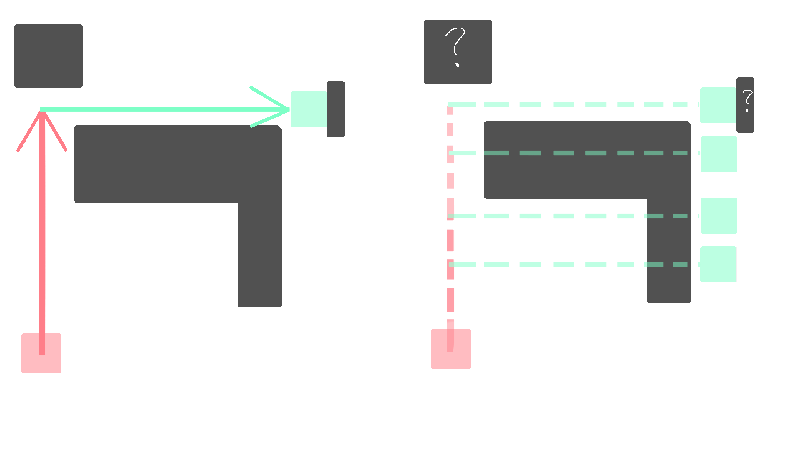
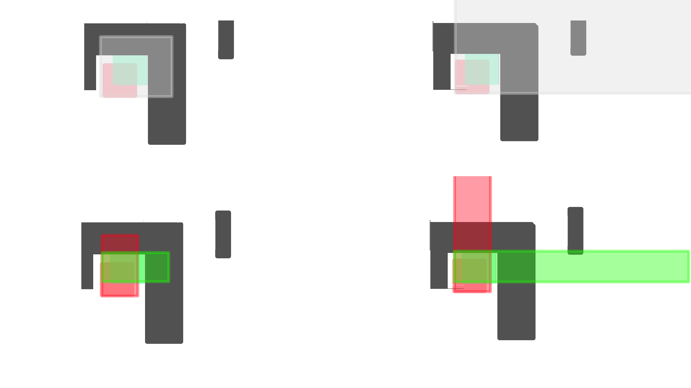

> “一个实体1gt内如果要在 x 和 z 轴各移动 100 格，它就需要检测 100×100 空间内的方块和实体碰撞，再加上 y 轴，那简直完蛋。”

当我第一次听到这个说法时，我先是震惊，随即又觉得不可置信——真的会有这么庞大的计算量吗？

从各类视频和文章中我们可以了解到，Minecraft 中每一个游戏刻内，实体的斜向移动是沿各轴分步进行的。每次移动时，游戏会根据动量大小依次处理各轴：**先移动 y 轴，再在 z、x 轴中先移动动量较大的一方，动量较小的一方随后移动**。


在这种移动模式下，一次性收集从起点到终点整个箱型空间内的所有碰撞体似乎是不必要的。
因为在实际移动过程中，实体实际上只会与这个箱体的"三个面"上的"三条"方块发生交互，其余区域的方块根本不会参与碰撞检测。


那么先前的说法是真的吗？若是真的，为何要进行如此夸张的检测呢？Mojang又是如何实现分轴移动的呢？

---

为了解决这个问题，我们必须找到实体移动部分的代码。它是位于`Entity.class`的`move(MovementType type, Vec3d movement)` 。

```Java{15,33-36}
public void move(MovementType type, Vec3d movement) {// [!code focus]
...
  Profiler profiler = Profilers.get();
  profiler.push("move");
  if (this.movementMultiplier.lengthSquared() > 1.0E-7) {
      if (type != MovementType.PISTON) {
          movement = movement.multiply(this.movementMultiplier);
      }

      this.movementMultiplier = Vec3d.ZERO;
      this.setVelocity(Vec3d.ZERO);
  }

  movement = this.adjustMovementForSneaking(movement, type);
  Vec3d vec3d = this.adjustMovementForCollisions(movement);// [!code focus]
  double d = vec3d.lengthSquared();
  if (d > 1.0E-7 || movement.lengthSquared() - d < 1.0E-7) {
    if (this.fallDistance != 0.0 && d >= 1.0) {
        double e = Math.min(vec3d.length(), 8.0);
        Vec3d vec3d2 = this.getEntityPos().add(vec3d.normalize().multiply(e));
        BlockHitResult blockHitResult = this.getEntityWorld()
            .raycast(
                new RaycastContext(
                    this.getEntityPos(), vec3d2, RaycastContext.ShapeType.FALLDAMAGE_RESETTING, RaycastContext.FluidHandling.WATER, this
                )
            );
        if (blockHitResult.getType() != HitResult.Type.MISS) {
            this.onLanding();
        }
    }
  }

  Vec3d vec3d3 = this.getEntityPos();// [!code focus]
  Vec3d vec3d4 = vec3d3.add(vec3d);// [!code focus]
  this.addQueuedCollisionChecks(new Entity.QueuedCollisionCheck(vec3d3, vec3d4, movement));// [!code focus]
  this.setPosition(vec3d4);// [!code focus]
}
...
```
通过这一过程，我们可以发现，`adjustMovementForCollisions(Vec3d movement)` 方法接收一个动量参数，并返回一个代表**实际移动距离**的 `Vec3d`。  
随后，实体会将自身的坐标向量（`vec3d3`）加上这个移动距离，得到新的坐标 `vec3d4`，并直接将位置设置为 `vec3d4`。  

这意味着，**实体的移动行为几乎完全由 `adjustMovementForCollisions(Vec3d movement)` 负责**。
那么，让我们再来看看 `adjustMovementForCollisions(Vec3d movement)` 。
```java{2-4}
    private Vec3d adjustMovementForCollisions(Vec3d movement) {// [!code focus]
        Box box = this.getBoundingBox();// [!code focus]
        List<VoxelShape> list = this.getEntityWorld().getEntityCollisions(this, box.stretch(movement));// [!code focus]
        Vec3d vec3d = movement.lengthSquared() == 0.0 ? movement : adjustMovementForCollisions(this, movement, box, this.getEntityWorld(), list);// [!code focus]
        boolean bl = movement.x != vec3d.x;
        boolean bl2 = movement.y != vec3d.y;
        boolean bl3 = movement.z != vec3d.z;
        boolean bl4 = bl2 && movement.y < 0.0;
        if (this.getStepHeight() > 0.0F && (bl4 || this.isOnGround()) && (bl || bl3)) {
            Box box2 = bl4 ? box.offset(0.0, vec3d.y, 0.0) : box;
            Box box3 = box2.stretch(movement.x, this.getStepHeight(), movement.z);
            if (!bl4) {
                box3 = box3.stretch(0.0, -1.0E-5F, 0.0);
            }

            List<VoxelShape> list2 = findCollisionsForMovement(this, this.world, list, box3);
            float f = (float)vec3d.y;
            float[] fs = collectStepHeights(box2, list2, this.getStepHeight(), f);

            for (float g : fs) {
                Vec3d vec3d2 = adjustMovementForCollisions(new Vec3d(movement.x, g, movement.z), box2, list2);
                if (vec3d2.horizontalLengthSquared() > vec3d.horizontalLengthSquared()) {
                    double d = box.minY - box2.minY;
                    return vec3d2.subtract(0.0, d, 0.0);
                }
            }
        }

        return vec3d;// [!code focus]
    }
```
在这里，我们可以看到，实体盒沿`movement` ==拉伸成包围盒，收集盒内所有实体碰撞体，=={.important}并传入另一个`adjustMovementForCollisions(@Nullable Entity entity, Vec3d movement, Box entityBoundingBox, World world, List<VoxelShape> collisions) `方法，得到了初步结果`vec3d`。
这个`vec3d`经过一些爬高用处理（我们暂时不关心）后被返回。

我们现在可以证实，移动起点到终点的包围盒内，实体碰撞体的确被全部收集了。但仍然没有看到与方块相关的操作，让我们继续深入。
```java{2}
  public static Vec3d adjustMovementForCollisions(@Nullable Entity entity, Vec3d movement, Box entityBoundingBox, World world, List<VoxelShape> collisions) {
      List<VoxelShape> list = findCollisionsForMovement(entity, world, collisions, entityBoundingBox.stretch(movement));
      return adjustMovementForCollisions(movement, entityBoundingBox, list);
  }
```
在这里，我们可以看到新的碰撞体列表被创建，由`findCollisionsForMovement`填充。之前得到的，包含包围盒内所有实体碰撞体的列表也被传入其中。
我们继续深入...
```java{15}
  private static List<VoxelShape> findCollisionsForMovement(
      @Nullable Entity entity, World world, List<VoxelShape> regularCollisions, Box movingEntityBoundingBox
  ) {
      Builder<VoxelShape> builder = ImmutableList.builderWithExpectedSize(regularCollisions.size() + 1);// [!code focus]
      if (!regularCollisions.isEmpty()) {
          builder.addAll(regularCollisions);// [!code focus]
      }

      WorldBorder worldBorder = world.getWorldBorder();// [!code focus]
      boolean bl = entity != null && worldBorder.canCollide(entity, movingEntityBoundingBox);
      if (bl) {
          builder.add(worldBorder.asVoxelShape());// [!code focus]
      }

      builder.addAll(world.getBlockCollisions(entity, movingEntityBoundingBox));// [!code focus]
      return builder.build();// [!code focus]
  }
```
我们发现，在这里，`world.getBlockCollisions` ==的确收集起点到终点包围盒内所有方块的 `VoxelShape`。=={.important}并于世界边界，实体碰撞体列表合并输出。
也就是说，对于 x/z 各 100 格移动，盒体积达 100×100×（y 跨度），计算量的确是巨大的。
那么，收集完这么多的碰撞体后，`adjustMovementForCollisions(Vec3d movement, Box entityBoundingBox, List<VoxelShape> collisions)` 是如何使用它们的呢？为什么需要如此大范围的收集呢？
```java{7-11}
  private static Vec3d adjustMovementForCollisions(Vec3d movement, Box entityBoundingBox, List<VoxelShape> collisions) {
      if (collisions.isEmpty()) {
          return movement;
      } else {
          Vec3d vec3d = Vec3d.ZERO;

          for (Direction.Axis axis : Direction.method_73163(movement)) {// [!code focus]
              double d = movement.getComponentAlongAxis(axis);// [!code focus]
              if (d != 0.0) {// [!code focus]
                  double e = VoxelShapes.calculateMaxOffset(axis, entityBoundingBox.offset(vec3d), collisions, d);// [!code focus]
                  vec3d = vec3d.withAxis(axis, e);// [!code focus]
              }
          }

          return vec3d;// [!code focus]
      }
  }
```
我们可以看到，`Direction.method_73163(movement) `根据`movement`返回按移动顺序排列的轴（先 y 轴，x 和 z 大的一轴靠前）。
对每个轴：

- 获取在该轴上的移动量 `d`
- 如果 `d != 0`，调用 `VoxelShapes.calculateMaxOffset`：
- - 输入：当前轴、实体当前包围盒（加上已有调整的移动 `vec3d`）、碰撞列表、目标移动量 `d`
- - 输出：在不与任何碰撞体重叠的情况下，沿该轴可允许的最大移动量 `e`
- 更新 `vec3d` 的对应轴分量为 `e`

最后返回调整后的移动向量。

现在，我们终于可以更清晰地理先前的描述：

> “先移动 y 轴，再在 z、x 轴中先移动动量较大的一方，动量较小的一方随后移动”的真实含义了。  

这句话乍听之下，似乎是在说：

>「实体会先沿 y 轴移动到能到达的最大位置，再从新的位置出发，依次在 x、z 轴上继续移动。」

但实际上，Minecraft 的实现方式是：

> 「先计算出沿该y轴能移动的最大距离，再临时更新用于检测的起点位置，再依次在 x、z进行同样的操作，最后一次性地移动到计算结果处。」  

也就是说，Minecraft 的碰撞检测并非「分段移动」，而是「逐轴修正后的整体移动」。

现在，我们就可以理解为什么需要收集起点到终点包围盒内的全部碰撞体了。

在本文一开始的设想中，实体进行「分段移动」，实体可以在处理每个轴的移动前收集一次相应的碰撞体。
由于此时实体确切地知道自己在前一轴移动后的位置，因此可以基于该位置，精确确定在下一轴上需要检测的碰撞体。

但是Mojang使用了另一种方式：

Mojang选择「逐轴修正后一次性移动」，它仅有一次机会获取可能发生碰撞的方块。
由于在计算前无法确定具体会在哪个轴或位置被阻挡，因此需要收集从起点到终点所覆盖包围盒中的所有潜在碰撞体。



现在，你可能感到困惑：

> “为什么要采用这样的移动方式？？为什么不移动完一个轴再进行下一次收集，而是一口气收集完？这样的收集太低效，太浪费了！”

但让我们仔细回想文章开头那个极端例子：「x、z 轴各移动 100 格」。在那样的高速移动下，“分段移动并逐次收集”确实更高效，因为每次只需关注相对较小的条形路径。

然而，放到真实的 Minecraft 环境中，这样的情况几乎不存在。你很难在正常游戏中看到各轴动量高达几十甚至上百格的实体。事实上，大多数非投掷物实体的轴向速度甚至不会超过 10 格每游戏刻（而投掷物遵循不同的移动策略）。

因此，在低动量场景下，一次性收集反而更划算：==它避免了在每个轴上重复执行收集逻辑的开销，简化了流程，而性能损耗也因为动量较小而几乎可以忽略。=={.important}



换句话说，

> 当动量大时，分轴收集更省；当动量小时，一次性收集反而更优。

而 Minecraft 的大部分实体都属于后者，所以一次性收集成为合理且高效的选择。

---

虽然在正常游戏流程中，几乎不可能看到各轴动量高达几十甚至上百格的实体，但我们都知道，玩家的创造力从来不受“正常”约束。

事实上，让我们来看看另一个直接促成这篇文章的例子。

我和几位群友在讨论时，被告知“未对齐的TNT簇”会造成极大的卡顿。理解了 Minecraft 实体实际的运动方式后，这个现象就不难解释了。

我们将TNT分为两簇：A簇与B簇。

当A簇爆炸时，如果B簇在 x、z 轴上与A簇完全重合，那么B簇只会受到来自A簇的强烈向下动量。

> [!NOTE]
> 这是因为TNT实体的爆炸中心位于其底部上方约 1/16 格处，也就是说，爆炸中心略高于实体的几何中心。
即便坐标完全重合，先爆炸的TNT仍会给后爆炸的TNT施加明显的向下推力。

但若A簇与B簇未完全对齐，情况就不同了。此时，B簇中的每个TNT会在==三个方向上都获得显著的动量=={.important}。与对齐时仅需在Y轴上进行收集不同，现在每个TNT都必须在一个庞大的三维包围盒中收集碰撞体。
这意味着大量的的碰撞收集，从而导致明显的卡顿。

那...对于上述的情况，我们应该怎么办呢..?
值得庆幸的是，[CarpetTISAddition的优化高速实体移动](https://blog.fallenbreath.me/zh-CN/2022/introduction-to-carpet-tis-addition_rules/?highlight=高速#优化高速实体移动-optimizedFastEntityMovement)将会帮你解决这个烦恼。
