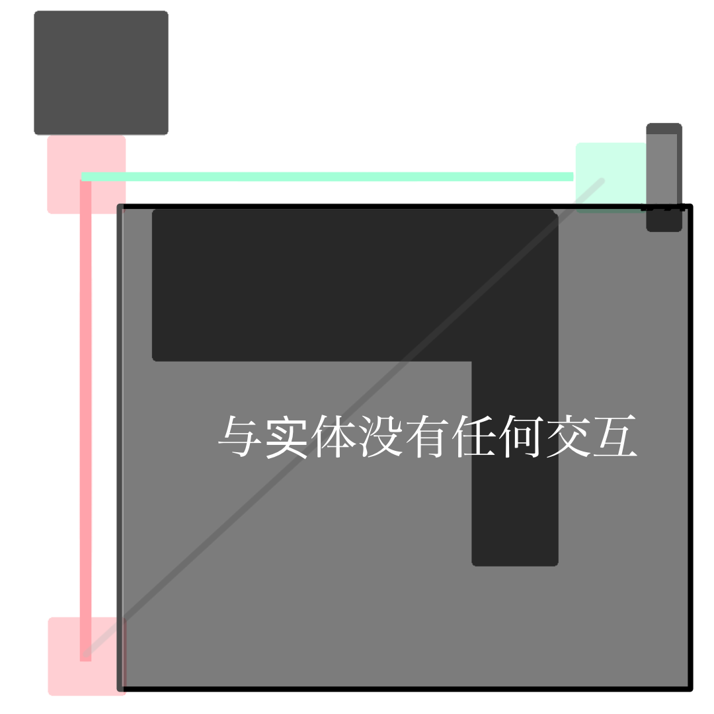

> “一个实体如果要在 x 和 z 轴各移动 100 格，它就需要检测 100×100 空间内的方块和实体碰撞，再加上 y 轴，那简直完蛋。”

当我第一次听到这个说法时，我先是震惊，随即又觉得不可置信——真的会有这么庞大的计算量吗？

从各类视频和文章中我们可以了解到，Minecraft 中实体的斜向移动是沿各轴分步进行的。每次移动时，游戏会根据动量大小依次处理各轴：**先移动 y 轴，再在 z、x 轴中先移动动量较大的一方，动量较小的一方随后移动**。


在这种移动模式下，一次性收集从起点到终点整个箱型空间内的所有碰撞体似乎是不必要的。
因为在实际移动过程中，实体实际上只会与这个箱体的三个面上的三条方块发生交互，其余区域的方块根本不会参与碰撞检测。



那么先前的说法是真的吗？若是真的，为何要进行如此夸张的检测呢？Mojang又是如何实现分轴移动的呢？

---

为了解决这个问题，我们必须找到实体移动部分的代码。它是位于`Entity.class`的`move(MovementType type, Vec3d movement)` 。

```Java
public void move(MovementType type, Vec3d movement) {
...
  Profiler profiler = Profilers.get();
  profiler.push("move");
  if (this.movementMultiplier.lengthSquared() > 1.0E-7) {
      if (type != MovementType.PISTON) {
          movement = movement.multiply(this.movementMultiplier);
      }

      this.movementMultiplier = Vec3d.ZERO;
      this.setVelocity(Vec3d.ZERO);
  }

  movement = this.adjustMovementForSneaking(movement, type);
  Vec3d vec3d = this.adjustMovementForCollisions(movement);// [!code focus]
  double d = vec3d.lengthSquared();
  if (d > 1.0E-7 || movement.lengthSquared() - d < 1.0E-7) {
    if (this.fallDistance != 0.0 && d >= 1.0) {
        double e = Math.min(vec3d.length(), 8.0);
        Vec3d vec3d2 = this.getEntityPos().add(vec3d.normalize().multiply(e));
        BlockHitResult blockHitResult = this.getEntityWorld()
            .raycast(
                new RaycastContext(
                    this.getEntityPos(), vec3d2, RaycastContext.ShapeType.FALLDAMAGE_RESETTING, RaycastContext.FluidHandling.WATER, this
                )
            );
        if (blockHitResult.getType() != HitResult.Type.MISS) {
            this.onLanding();
        }
    }
  }

  Vec3d vec3d3 = this.getEntityPos();// [!code focus]
  Vec3d vec3d4 = vec3d3.add(vec3d);// [!code focus]
  this.addQueuedCollisionChecks(new Entity.QueuedCollisionCheck(vec3d3, vec3d4, movement));// [!code focus]
  this.setPosition(vec3d4);// [!code focus]
}
...
```
通过这一过程，我们可以发现，`adjustMovementForCollisions` 方法接收一个动量参数，并返回一个代表**实际移动距离**的 `Vec3d`。  
随后，实体会将自身的坐标向量（`vec3d3`）加上这个移动距离，得到新的坐标 `vec3d4`，并直接将位置设置为 `vec3d4`。  

这意味着，**实体的移动行为几乎完全由 `adjustMovementForCollisions` 负责**。
