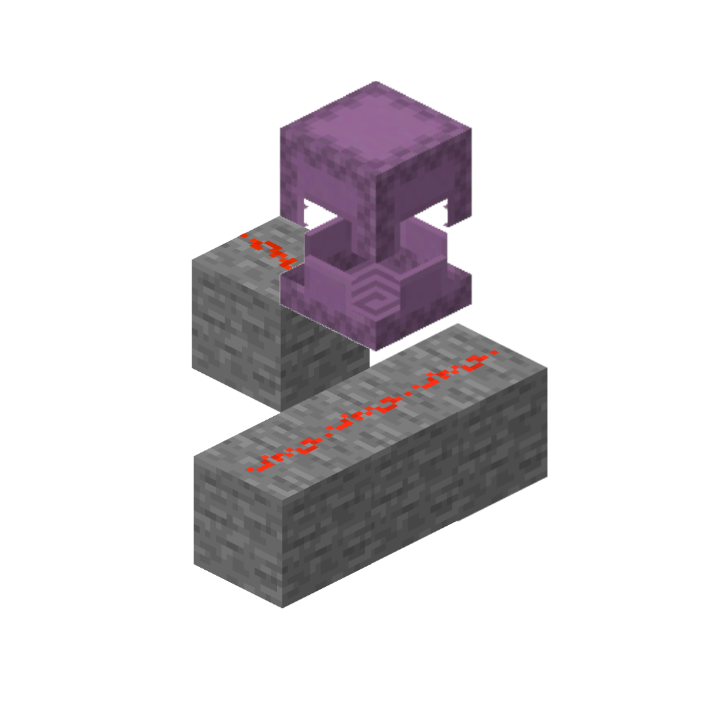

本文将讨论一个红石粉连接相关的异常，并分享些许分析思路。如下是本篇文章将讨论的连接异常。



> 如上图所示，大开的潜影盒有奇怪的压线行为，潜影盒打开后不再实心，应该停止压线。但实际表现却不同：虽然视觉上下方的红石线未为与上方的红石线连接，但实际通入红石信号时，信号可以穿过打开的潜影盒传递到放上放的红石线。形成了“没有连接但可以通电”的奇怪场景。

---

# 寻找问题

仔细观察，我们正面临一个红石粉的连接问题。根据常识，红石粉能否向上爬上方块，取决于该方块是否实心。

此外，有趣的是：尽管下方的红石粉没有向侧面连接，上方的红石粉却变成了一字型：这意味着上方的粉认为自己能与下方的粉建立连接，而下方的粉却不这么认为。

综合这些信息，我们大致可以推断出原因：当**下方的粉判断是否应该向上连接时**与**当上方的粉判断是否可以向下连接时**，两者对“打开的潜影盒是否属于实心方块”产生了分歧。

# 搜索代码

有了上述推断后，我们可以以“判断方块是否属于实心方块”为切入点，在红石粉的代码中寻找相关逻辑。具体来说，需要关注以下字段与方法：`isRedstoneConductor(level, pos)`。

在`RedstoneWireBlock.java`中搜索，可以找到5处调用:

```java

boolean canConnectUp = !level.getBlockState(pos.above()).isRedstoneConductor(level, pos);

!level.getBlockState(pos.above()).isRedstoneConductor(level, pos));

... && (relativeState.isRedstoneConductor(level, relativePos) ...

if (level.getBlockState(target).isRedstoneConductor(level, target))

... && level.getBlockState(relativePos).isRedstoneConductor(level, relativePos)...

```

让我们看看第一条，
```java
private BlockState getMissingConnections(final BlockGetter level, BlockState state, final BlockPos pos) {
        boolean canConnectUp = !level.getBlockState(pos.above()).isRedstoneConductor(level, pos);  // [!code focus]

        for (Direction direction : Direction.Plane.HORIZONTAL) {
            if (!state.getValue(PROPERTY_BY_DIRECTION.get(direction)).isConnected()) {
                RedstoneSide sideConnection = this.getConnectingSide(level, pos, direction, canConnectUp); // [!code focus]
                state = state.setValue(PROPERTY_BY_DIRECTION.get(direction), sideConnection);
            }
        }

        return state;
}
```
看起来第一行条调用就与“能否向上连接”直接相关，不仅布尔变量叫做“能否向上连接”，还出现了`pos.above()`的关键位置信息。我们再看看第二条：
```java
private RedstoneSide getConnectingSide(final BlockGetter level, final BlockPos pos, final Direction direction) {
        return this.getConnectingSide(level, pos, direction, !level.getBlockState(pos.above()).isRedstoneConductor(level, pos));
}
```
看来这次调用也一样，同样出现了`pos.above()`和`getConnectingSide`，意图明确的词汇。说明这两次调用都是关于**下方的粉是否应该向上连接**的。

再看看第三条：
```java
private RedstoneSide getConnectingSide(final BlockGetter level, final BlockPos pos, final Direction direction, final boolean canConnectUp) {
        BlockPos relativePos = pos.relative(direction); // [!code focus]
        BlockState relativeState = level.getBlockState(relativePos); // [!code focus]
        if (canConnectUp) {
            boolean isPlaceableAbove = relativeState.getBlock() instanceof TrapDoorBlock || this.canSurviveOn(level, relativePos, relativeState);
            if (isPlaceableAbove && shouldConnectTo(level.getBlockState(relativePos.above()))) {
                if (relativeState.isFaceSturdy(level, relativePos, direction.getOpposite())) {
                    return RedstoneSide.UP;
                }

                return RedstoneSide.SIDE;
            }
        }

        return !shouldConnectTo(relativeState, direction)                     // [!code focus]
         && (                                                                 // [!code focus]
                relativeState.isRedstoneConductor(level, relativePos)        // [!code focus]
                ||!shouldConnectTo(level.getBlockState(relativePos.below())) // [!code focus]
         )                                                                   // [!code focus]
            ? RedstoneSide.NONE // [!code focus]
            : RedstoneSide.SIDE; // [!code focus]
 }
```
根据`pos.relative(direction)`可以判断出，这次判断是以是**对侧面连接的判断为起点**，而结尾处`shouldConnectTo(level.getBlockState(relativePos.below()))`额外引出了**对是否可以从上往下连接的判断**。

上述代码描述的是这样一种情况：

- 当前红石粉不应该与侧面的方块连接（即侧方块不是红石粉，也不是可引导红石线的方块）；
- 并且，满足以下条件之一：
  - 侧面的方块是实心方块（会“压线”，导致无法向上连接）；
  - 或者无法与侧下方的方块连接（即侧下方没有红石粉）。
 
此时，当前红石粉将不会专门变为连接形状，否则保持侧面连接。

 现在我们似乎已经掌握了可以对比的两段代码：
 - 第一段的 level.getBlockState(pos.above()).isRedstoneConductor(level, pos)); 认为开启的潜影盒是实心的；
 - 第三段的 level.getBlockState(relativePos).isRedstoneConductor(level, relativePos)认为开启的潜影盒不是实心的。

仔细对比，我们就能发现问题：

**第一段代码：**
```java
level.getBlockState(pos.above()).isRedstoneConductor(level, pos)
```
- 判断的是上方的方块，但传入的位置却是红石粉自己（`pos`）

**第三段代码：**
```java
relativeState.isRedstoneConductor(level, relativePos)
```
- 判断的是侧方的方块，传入的位置也是该方块自己

第一段错把红石粉自己的位置当成了判断依据：红石粉本身不是实心，按理说 `canConnectUp` 永远为 `true`。  
但实际游戏中压线机制对普通方块却正常工作，说明该方法**内部忽略了传入的位置参数**，实际以第一个参数的方块为准。

然而对于开启的潜影盒，却出现了不一致：
- 第一段误判为实心（导致无法向上连接）
- 第三段正确判为非实心

这说明 `isRedstoneConductor` 的实现存在**参数使用不一致**的情况，正是上下连接判断分歧的根源。

---

追踪 `isRedstoneConductor` 后发现，它的默认判断依据是方块的 `getShape` 返回的碰撞体是否为完整方块大小。

既然已有 `blockState`，按理说可以直接获取形状，`pos` 在默认实现中确实被忽略。这解释了为什么第一段代码即使传错了 `pos`，普通方块依然能正确判断压线。

但 `isRedstoneConductor` 仍然需要 `pos` 参数，是因为存在**方块实体**：潜影盒、活塞头等方块的碰撞体形状无法从 `blockState` 静态获取，必须根据 `pos` 找到对应位置的方块实体实例才能确定。

因此，第一段代码对普通方块**“意外正确”**，但对开启的潜影盒这类依赖方块实体形状的方块，由于传入了错误的 `pos`，问题得到了体现。

最后，查询ShulkerBoxBlock.java对getShape的覆盖，我们得以验证这个问题：
    @Override
    protected VoxelShape getShape(final BlockState state, final BlockGetter level, final BlockPos pos, final CollisionContext context) {
        return level.getBlockEntity(pos) instanceof ShulkerBoxBlockEntity shulkerBoxBlockEntity// [!code focus]
            ? Shapes.create(shulkerBoxBlockEntity.getBoundingBox(state))// [!code focus]
            : Shapes.block();                                           // [!code focus]
    }
。
